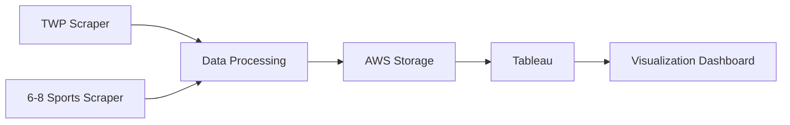
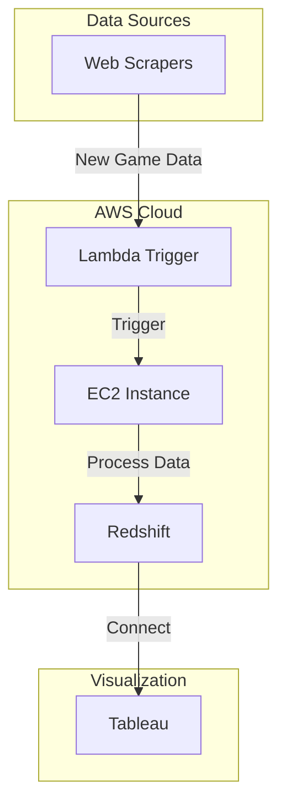
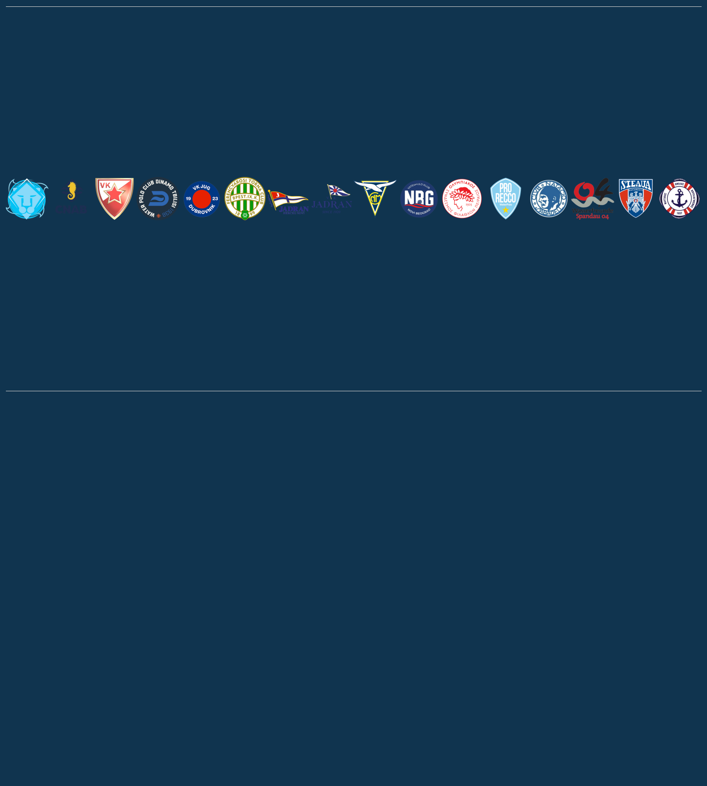
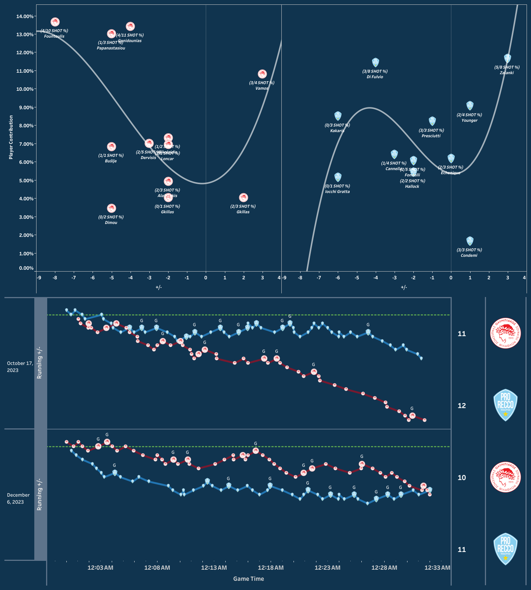

# Water Polo Data Pipeline

This project implements an automated data pipeline for collecting and analyzing water polo match data from multiple sources, including Total Water Polo (TWP) and 6-8 Sports platforms. The data is processed, stored in AWS, and visualized using Tableau.

> **Legal Note**: This project's data collection methods are legally protected under the precedent set by [hiQ Labs v. LinkedIn](https://en.wikipedia.org/wiki/HiQ_Labs_v._LinkedIn), which established that web scraping of publicly available data is legal under U.S. law.

## Data Flow Architecture



## AWS Infrastructure



## Components

### 1. Data Collection
- **TWP Scraper** (`twp_scraper.py`): Collects match data from Total Water Polo platform
  - Play-by-play data
  - Team statistics
  - Match metadata
  - Player performance metrics

- **6-8 Sports Scraper** (`6_8_scraper.py`): Collects data from 6-8 Sports platform
  - Game statistics
  - Team performance data
  - Match details

### 2. Data Processing
- **TWP Constructor** (`twp_constructor.py`): Processes and standardizes data from both sources
  - Data cleaning and normalization
  - Format standardization
  - Data validation

### 3. Data Storage
- **AWS Infrastructure**:
  - Lambda triggers on new game creation
  - EC2 instances for data processing
  - Redshift for data warehousing
  - Tableau connector for visualization
- Structured data storage for easy querying
- Historical data archiving

### 4. Visualization
- Tableau dashboards for data analysis
- Interactive visualizations
- Performance metrics and trends
- Team and player statistics

## Example Visualizations

### Champions League Analysis
[View Champions League Breakdown](https://public.tableau.com/app/profile/ryan.hurst/viz/ChampionsLeagueBreakdown2/OLYRECChampionsLeague)





### Champions League Individual Contributions
[View Individual Contributions Analysis](https://public.tableau.com/app/profile/ryan.hurst/viz/MatchupAnalysisChampionsLeague/OLYRECChampionsLeague)

.png)

### World Championships 2024: Croatia vs Italy
[View Croatia vs Italy Analysis](https://public.tableau.com/app/profile/ryan.hurst/viz/CroatiaVSItalyWorldChampionships2024/OLYRECChampionsLeague)

.png)
.png)

### National League 2023 Breakdown
[View National League 2023 Analysis](https://public.tableau.com/app/profile/ryan.hurst/viz/CroatiaVSItalyWorldChampionships2024/OLYRECChampionsLeague)


## Setup and Installation

1. Clone the repository
2. Install dependencies:
```bash
pip install -r requirements.txt
```

3. Configure AWS credentials
4. Set up Tableau connection

## Dependencies

- selenium==4.15.2
- fake-useragent==1.4.0
- numpy==1.24.3
- pandas==2.1.3
- openpyxl==3.1.2
- requests-html==0.10.0
- beautifulsoup4==4.12.2
- playwright==1.41.2
- regex==2023.12.25

## Usage

### Setup

1. **Create and activate a virtual environment:**
   ```bash
   # Create virtual environment
   python -m venv venv
   
   # Activate virtual environment
   # On macOS/Linux:
   source venv/bin/activate
   # On Windows:
   .\venv\Scripts\activate
   
   # Verify activation (should show path to venv)
   which python  # macOS/Linux
   where python  # Windows
   ```

2. **Install dependencies:**
   ```bash
   # Upgrade pip first
   python -m pip install --upgrade pip
   
   # Install dependencies
   pip install -r requirements.txt
   
   # Verify installations
   pip list
   ```

3. **ChromeDriver Setup:**
   - Check your Chrome browser version:
     - Open Chrome
     - Click three dots (⋮) → Help → About Google Chrome
     - Note the version number (e.g., 120.0.6099.109)
   
   - Download matching ChromeDriver:
     - Visit [ChromeDriver Downloads](https://chromedriver.chromium.org/downloads)
     - Select version matching your Chrome browser
     - Download for your OS (macOS/Windows/Linux)
   
   - Installation:
     ```bash
     # macOS/Linux
     # 1. Move to project directory
     mv ~/Downloads/chromedriver ./chromedriver
     
     # 2. Make executable
     chmod +x chromedriver
     
     # 3. Remove quarantine (macOS only)
     xattr -d com.apple.quarantine chromedriver
     
     # Windows
     # 1. Move chromedriver.exe to project directory
     # 2. Add to PATH or use full path in code
     ```

### Troubleshooting

1. **Virtual Environment Issues:**
   ```bash
   # If venv creation fails
   python -m pip install --upgrade virtualenv
   
   # If activation fails
   # macOS/Linux:
   chmod +x venv/bin/activate
   # Windows:
   Set-ExecutionPolicy -ExecutionPolicy RemoteSigned -Scope CurrentUser
   ```

2. **ChromeDriver Issues:**
   - Version mismatch:
     ```bash
     # Check Chrome version
     # macOS:
     /Applications/Google\ Chrome.app/Contents/MacOS/Google\ Chrome --version
     # Windows:
     reg query "HKEY_CURRENT_USER\Software\Google\Chrome\BLBeacon" /v version
     ```
   - Permission errors:
     ```bash
     # macOS/Linux
     sudo chmod +x chromedriver
     # Windows
     # Run as administrator
     ```
   - Path issues:
     ```bash
     # Verify ChromeDriver location
     which chromedriver  # macOS/Linux
     where chromedriver  # Windows
     ```

3. **Package Installation Issues:**
   ```bash
   # Clear pip cache
   pip cache purge
   
   # Force reinstall packages
   pip install --force-reinstall -r requirements.txt
   
   # Install specific version if needed
   pip install pandas==2.0.3
   ```

### Running the Scrapers

1. **TWP Scraper:**
   ```bash
   # Ensure virtual environment is active
   python twp_scraper.py
   ```

2. **6-8 Sports Scraper:**
   ```bash
   # Ensure virtual environment is active
   python 6_8_scraper.py
   ```

3. **TWP Constructor:**
   ```bash
   # Ensure virtual environment is active
   python twp_constructor.py
   ```

## Visualization

View the interactive dashboards at: [Tableau Public Profile](https://public.tableau.com/app/profile/ryan.hurst/vizzes)

## Custom Analysis

For custom analysis and development of sport-specific metrics, please contact:
- Email: ryanhurst@berkeley.edu

## Contributing

1. Fork the repository
2. Create a feature branch
3. Commit your changes
4. Push to the branch
5. Create a Pull Request

## License

This project is licensed under the MIT License - see the LICENSE file for details.